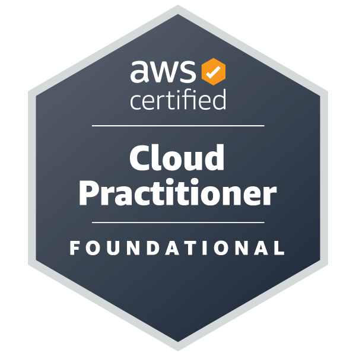

<h1 align="center">Hi there , I'm Antonio Saleme</h1>
<h3 align="center">Web Developer</h3>

<h3 align="left">About me:</h3>

I’m a web developer and AWS Cloud Engineer with a background in opera singing. I have transitioned into tech and gained experience in frontend development, working with various modern technologies. Previously, I worked at Vehiculum.de as a Frontend Developer, and I am currently dedicating myself to web development and cloud engineering.

### 📊 GitHub Stats:

  
  

<h3 align="left">Certifications 2025:</h3>
<ul>
  <li><a href="https://www.credly.com/badges/abefd6e2-4849-46e1-9860-b310162fad04" target="_blank">AWS re/Start Graduate</a></li>
  <li><a href="https://www.credly.com/badges/de23a960-092a-4387-9597-4816c7b116d9" target="_blank">AWS Certified Cloud Practitioner</a></li>
  <li><a href="https://eu.images.credential.net/embed/qzvfsgel.png" target="_blank">AWS Cloud Engineer 🎯 (Neue Fische)</a></li>
  <li><a href="https://www.udemy.com/certificate/UC-1747060d-cb70-4166-93fe-2b048fa1cd61">Terraform: From Beginner to Certified 2025</a></li>
</ul>

<h3 align="left">Certifications 2024:</h3>
<ul>
  <li><a href="https://cursos.devtalles.com/certificates/sawtn3cqr1">Next.js: The React Framework for Production</a></li>
  <li><a href="https://cursos.devtalles.com/certificates/avxskvpiur">Docker - Practical Usage Guide for Developers</a></li>
  <li><a href="https://www.udemy.com/certificate/UC-695b0067-f675-4053-8e56-40ec648c388c/">Nest: Scalable backend development with Node.</a></li>
  <li><a href="https://cursos.devtalles.com/certificates/ttp0r00jmj">Node - REST Authentication with Clean Architecture</a></li>
</ul>

<h3 align="left">Certifications 2023:</h3>
<ul>
  <li><a href="https://cursos.devtalles.com/certificates/fdvtoaz2oa">React Query - A powerful asynchronous state manager.</a></li>
</ul>

### 🛠️ Current Project:

I'm currently working on an e-commerce project for an Argentine furniture store called <strong>K'óoben</strong>. The frontend is built using <strong>Next.js</strong>, <strong>TypeScript</strong>, <strong>Mantine</strong>, <strong>Axios</strong>, and <strong>Clerk</strong> for authentication. You can view the frontend <a href="https://github.com/thusspokedata/kooben-fe">here</a>.

The backend is developed with <strong>NestJS</strong>. You can explore the backend <a href="https://github.com/thusspokedata/kooben-be">here</a>.

<h3 align="left">🏆 Badges:</h3>

  
  

<a href="https://github.com/thusspokedata/index-readme">Private Index</a>

